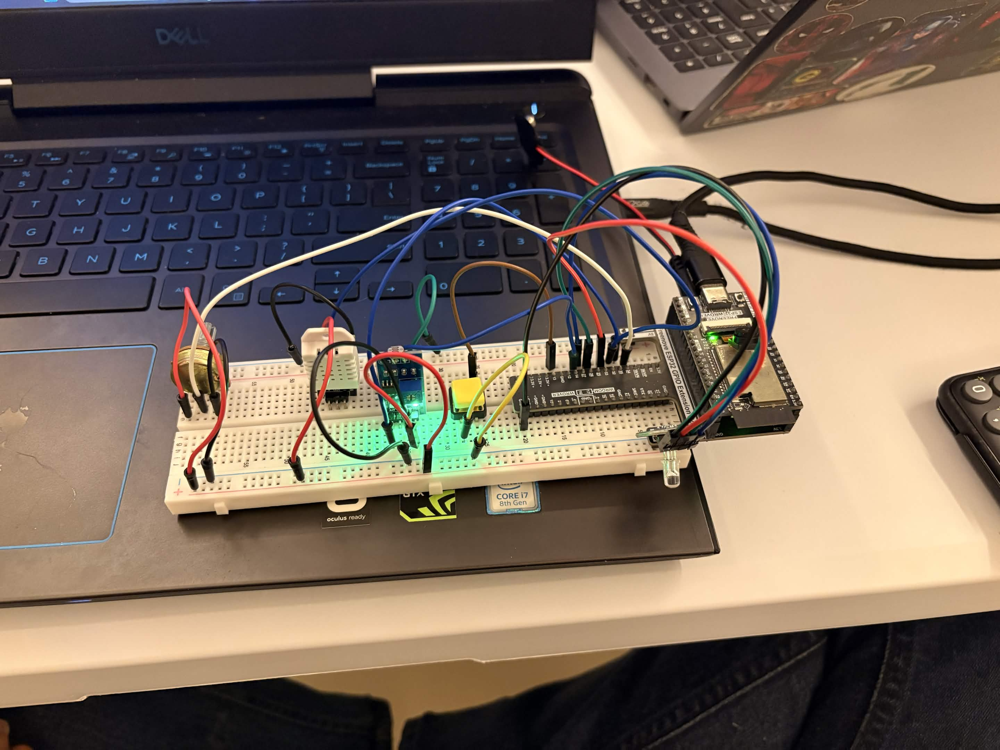
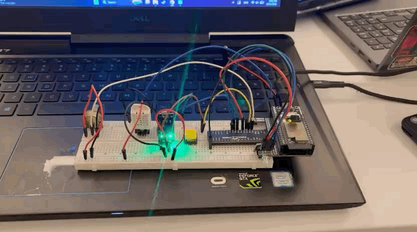
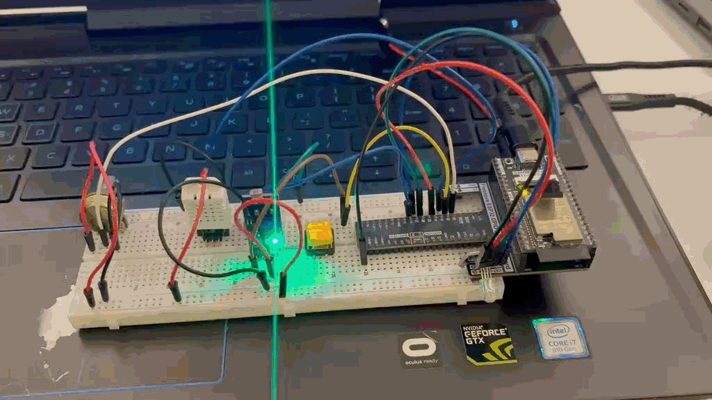
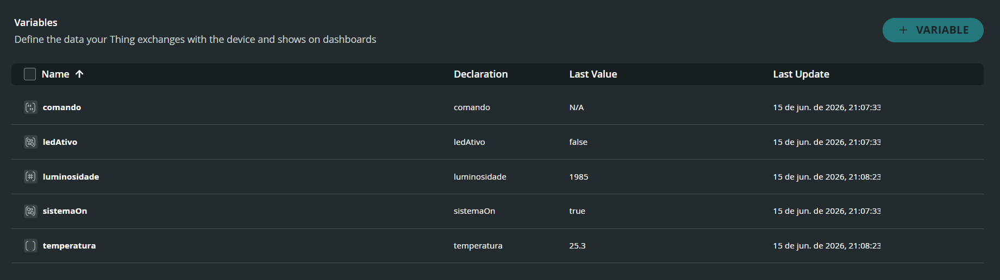
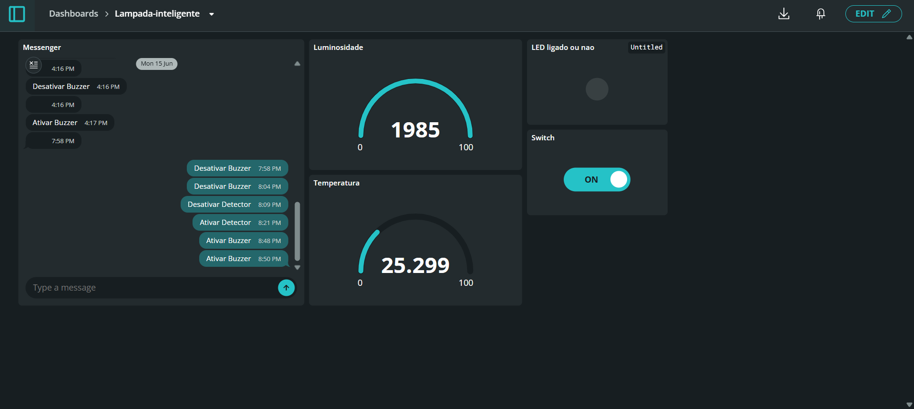
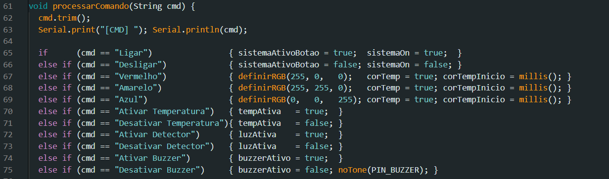

# 💡 Lâmpada Inteligente

Sistema IoT de iluminação inteligente desenvolvido com ESP32-WROVER, capaz de adaptar cor e brilho automaticamente com base em condições ambientais, e ser controlado remotamente via Arduino IoT Cloud.



---

##  Hardware utilizado

| Componente | Descrição |
|---|---|
| Freenove ESP32-WROVER | Microcontrolador principal com Wi-Fi |
| DHT22 | Sensor de temperatura e umidade |
| Módulo LDR | Sensor de luminosidade |
| LED RGB | Lâmpada do sistema |
| Buzzer passivo | Alarme sonoro |
| Potenciômetro | Controle manual de cor |
| Botão | Liga/desliga físico |

---

##  Pinagem

| Componente | Pino GPIO |
|---|---|
| Botão | 13 |
| Potenciômetro | 34 |
| LDR (AO) | 35 |
| DHT22 | 32 |
| Buzzer | 14 |
| LED RGB — Vermelho | 33 |
| LED RGB — Verde | 26 |
| LED RGB — Azul | 27 |

>  GPIO 16 e 17 não estão disponíveis no ESP32-WROVER (reservados para PSRAM).  
>  Pinos analógicos em ADC1 (32, 34, 35) para compatibilidade com Wi-Fi ativo.
>  A depender da ESP32 utilizada, a pinagem pode mudar.

---

##  Lógica de funcionamento

```
Botão pressionado → toggle liga/desliga (interrupção externa)

Temperatura > 25°C ou < 0°C:
  → Serial: "Perigo! Desligar!"
  → Buzzer liga
  → LED desliga

Ambiente claro (LDR alto):
  → LED desliga automaticamente

Ambiente escuro + temperatura OK:
  → LED liga
  → Cor definida pelo potenciômetro
      Baixo       → Vermelho
      Médio-baixo → Laranja
      Médio       → Branco
      Médio-alto  → Azul turquesa
      Alto        → Azul
```

### LED apagando com a luz ambiente


### Cor variando com o potenciômetro


---

## ☁️ Arduino IoT Cloud

### Variáveis criadas



| Nome | Tipo | Permissão | Atualização |
|---|---|---|---|
| `comando` | String | Read & Write | On change |
| `temperatura` | float | Read Only | A cada 5s |
| `luminosidade` | int | Read Only | A cada 5s |
| `ledAtivo` | bool | Read Only | On change |
| `sistemaOn` | bool | Read & Write | On change |

### Dashboard



| Widget | Variável | Função |
|---|---|---|
| Messenger | `comando` | Envia comandos de texto |
| Gauge | `temperatura` | Temperatura em tempo real |
| Gauge | `luminosidade` | Luminosidade em tempo real |
| LED | `ledAtivo` | Estado do LED |
| Switch | `sistemaOn` | Liga/desliga remoto |

---

##  Comandos disponíveis

Digite no widget **Messenger** do dashboard:



| Comando | Ação |
|---|---|
| `Ligar` | Liga o sistema |
| `Desligar` | Desliga o sistema |
| `Vermelho` | LED vermelho por 1s |
| `Amarelo` | LED amarelo por 1s |
| `Azul` | LED azul por 1s |
| `Ativar Temperatura` | Ativa sensor de temperatura |
| `Desativar Temperatura` | Desativa sensor de temperatura |
| `Ativar Detector` | Ativa fotorresistor |
| `Desativar Detector` | Desativa fotorresistor |
| `Ativar Buzzer` | Ativa buzzer |
| `Desativar Buzzer` | Desativa buzzer |

---

##  Como rodar o projeto

### 1. Instalar as bibliotecas no Arduino IDE

- `ArduinoIoTCloud`
- `Arduino_ConnectionHandler`
- `DHT sensor library` (Adafruit)

### 2. Configurar credenciais

Cria o arquivo `arduino_secrets.h` na pasta do sketch:

```cpp
#define SECRET_SSID           "nome_da_rede"
#define SECRET_OPTIONAL_PASS  "senha_da_rede"
#define SECRET_DEVICE_KEY     "chave_do_device"
```

### 3. Configurar o Arduino IDE

- Placa: `ESP32 Dev Module`
- Upload Speed: `115200`
- Port: porta COM do ESP32

### 4. Upload

Conecta o ESP32 via USB e clica em **Upload**.

---

##  Estrutura do repositório

```
/
├── lampada_inteligente.ino   # Firmware principal
├── thingProperties.h         # Gerado pelo Arduino IoT Cloud
├── arduino_secrets.h         # Credenciais (não versionado)
├── .gitignore
├── README.md
└── assets/
    ├── circuito.jpg
    ├── dashboard.png
    ├── variaveis.png
    ├── comandos.png
    ├── ldr.gif
    └── pot.gif
```


